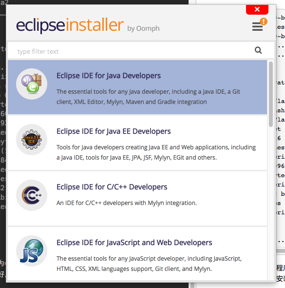
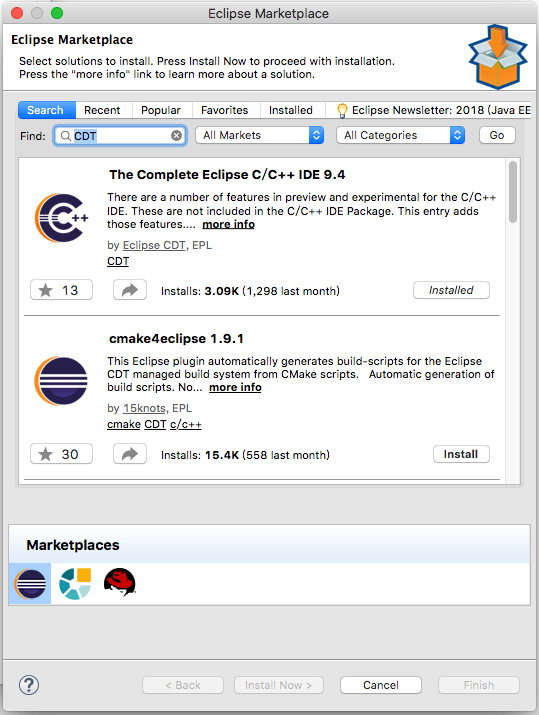
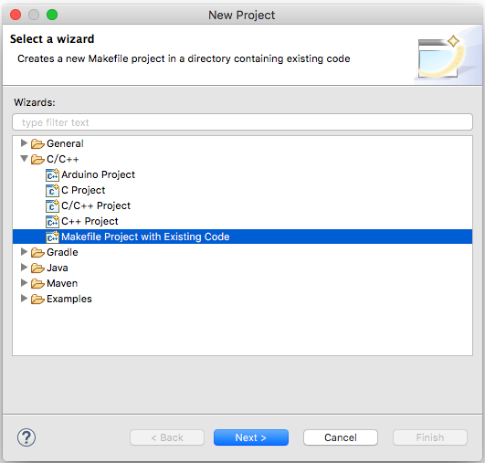
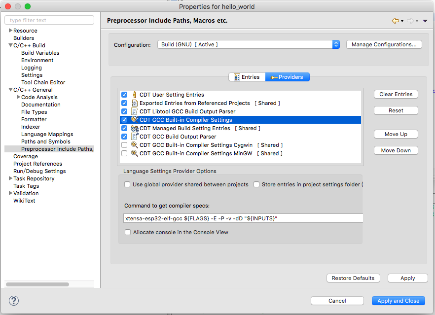

# OS X10.11.6 Eclipse ESP32开放环境搭建

<center>

<br/>
<font color="Gray">作者：潘全星   日期：2018-02-12</font>
</center>

**ESP** 系列芯片采用xtensa内核，可以使用windows、Linux和Mac OS X搭建开发环境，步骤上Linux与Mac OS X相似。本文参考[ESP－IDF编程指南](https://esp-idf.readthedocs.io/en/latest/get-started/index-cn.html#id3)。

## 安装设置工具链
1.自定义及自己编译工具链，请参考**Customized Setup of Toolchain**([Linux](https://esp-idf.readthedocs.io/en/latest/get-started/linux-setup-scratch.html)、[Mac OS X](https://esp-idf.readthedocs.io/en/latest/get-started/macos-setup-scratch.html))。

2.使用编译好的二进制工具链：

* 下载[xtensa-esp32-elf-osx-Toolchain](https://dl.espressif.com/dl/xtensa-esp32-elf-osx-1.22.0-80-g6c4433a-5.2.0.tar.gz)。
* 一定要解压到`~/esp`目录下：

```
mkdir -p ~/esp
cd ~/esp
tar -xzf ~/Downloads/xtensa-esp32-elf-osx-1.22.0-80-g6c4433a-5.2.0.tar.gz
```
3.添加**toolchain**到环境变量：

参考[**添加ESP－IDF**](#get-esp-idf-block)在环境变量文件尾部追加一行:
<font color="Red">`export PATH=$PATH:$HOME/esp/xtensa-esp32-elf/bin`</font>
## 获取ESP－IDF
使用`git clone`命令：

```
cd ~/esp
git clone --recursive https://github.com/espressif/esp-idf.git
```
如果忘记包含子模块clone参数`--recursive`的话，就要手动使用`submodule`参数更新子模块，命令：

```
cd ~/esp/esp-idf
git submodule update --init
```

## <a name="get-esp-idf-block" ><font color="black">添加ESP－IDF</font></a>
因为工具链中使用到名为`IDF_PATH`的ESP－IDF路径，往Linux系统用户环境变量中添加，使用`gedit ~/.profile`打开环境变量文件；往Mac OS X系统用户环境变量中添加，使用`open ~/.bash_profile`打开环境变量文件。
在环境变量文件尾部追加一行：

<font color="Red">
`export IDF_PATH=~/esp/esp-idf`
</font>

切记保持文件后，使用命令让其生效：

Linux：```source ~/.profile```

Mac OS X：```source ~/.bash_profile```

测试：```printenv IDF_PATH```

## 安装Anaconda
从[**anaconda官网**](https://www.anaconda.com/download/#macos)下载Mac OS X安装包，**默认会安装到用户目录下**。可以使用系统自带的Python环境，如果你是机器学习爱好者，建议使用anaconda，因为会自带很多科学计算的库。

安装Python串口模块：

```
pip install pyserial
```
因为将二进制freeRTOS包烧到ESP芯片flash上需要通过Python使用`~/esp/esp-idf`文件夹内的esptool.py，可以通过搜索找到。

## 安装串口驱动
如果开发板上的串口芯片是**CH34X**，下载[**驱动**](https://pan.baidu.com/s/1brfM5Fh)（密码:cm7x）。

如果开发板上的串口芯片是**CP2102**，下载[**驱动**](https://pan.baidu.com/s/1d4AOr0)（密码:bspx），[**官网网址**](https://www.silabs.com/products/development-tools/software/usb-to-uart-bridge-vcp-drivers)。

## 确认是否连接成功
打开终端，输入命令：

Mac OS X：
```
ls -l /dev/tty.*
```

Linux：
```
ls -l /dev/tty*
```

可以看到与串口芯片名字相似的设备，就证明该设备驱动安装成功，在操作系统上挂载的**port**了。

通过下命令使设备串口连接到系统终端，例如你的设备port为`/dev/tty.SLAB_USBtoUART`：

```
screen /dev/tty.SLAB_USBtoUART 115200
```
第三个参数为通信的波特率。
## 开始第一个Hello项目
将目录`~/esp/esp-idf/examples/get-started/`下的hello项目复制到`~/esp`，命令：

```
cd ~/esp
cp -r $IDF_PATH/examples/get-started/hello_world .
```
配置项目命令：

```
cd ~/esp/hello_world
make menuconfig
```
会出现下图的选择界面：


进入`Serial flasher config`->`Default serial port`，输入设备port。**Mac OS X**以`/dev/tty.`开头，例如：`/dev/tty.SLAB_USBtoUART`。**Linux**以`/dev/tty`开头，例如：`/dev/ttyUSB1`。

编译项目并烧录到flash：

```
make flash
```
如果成功出现下图，证明环境搭建基本成功。

```
esptool.py v2.0-beta2
Flashing binaries to serial port /dev/ttyUSB0 (app at offset 0x10000)...
esptool.py v2.0-beta2
Connecting........___
Uploading stub...
Running stub...
Stub running...
Changing baud rate to 921600
Changed.
Attaching SPI flash...
Configuring flash size...
Auto-detected Flash size: 4MB
Flash params set to 0x0220
Compressed 11616 bytes to 6695...
Wrote 11616 bytes (6695 compressed) at 0x00001000 in 0.1 seconds (effective 920.5 kbit/s)...
Hash of data verified.
Compressed 408096 bytes to 171625...
Wrote 408096 bytes (171625 compressed) at 0x00010000 in 3.9 seconds (effective 847.3 kbit/s)...
Hash of data verified.
Compressed 3072 bytes to 82...
Wrote 3072 bytes (82 compressed) at 0x00008000 in 0.0 seconds (effective 8297.4 kbit/s)...
Hash of data verified.

Leaving...
Hard resetting...
```

可以看到烧录使用的程序为**esptool.py**。要是报连接超时错误或者等待包头超时，很有可能驱动没安装好。

## 安装Eclipse
从[**Eclipse官网**](https://www.eclipse.org/downloads/)下载Mac OS X64位在线安装文件**eclipse-inst-mac64.tar.gz**，解压并安装，选择`Eclipse IDE for Java Developers`，如图所示：



安装好后，运行Eclipse，进入`Help->Eclipse Marketplaces...`搜索`CDT`，找到名为`The Complete Eclipse C/C++ IDE 9.4`的Eclipse CDT插件，点击`install`进行安装。



## 新建Eclipse Makefile项目
主菜单进入`File->New->Project...`双击`Makefile Project with Existing Code`，弹出来的目录选择器选择目录`~/esp/hello_world`点击｀Open｀，然后在弹出的面板下方选择“Cross GCC”，即可。



## 配置Eclipse项目
项目右键，在弹出来的菜单中选择`Properties`。

**第一步：**找到`C/C++ Build`->`Environment`，在**Environment**面板中点击`Add...`，分别添加以下三组用户环境参数：

Name          | Variables
------------- | -------------
BATCH_BUILD   |               1      
IDF_PATH      |(在终端通过命令`echo $IDF_PATH`打印出来的值)
PATH          |(在终端通过命令`echo $PATH`打印出来的值)

**第二步：**找到`C/C++ General`->`Preprocessor Include Paths`，在**Preprocessor Include Paths**面板中点击`Providers`。
点击`CDT GCC Built-in Compiler Settings`，将<font color="Red">`xtensa-esp32-elf-gcc ${FLAGS} -E -P -v -dD "${INPUTS}"`</font>粘贴到`Command to get compiler specs:`覆盖原值。如图所示：



Check上`CDT GCC Build Output Parser`，然后点击它，将<font color="Red">`xtensa-esp32-elf-(g?cc)|([gc]\+\+)|(clang)`</font>粘贴到`Compiler command pattern:`覆盖原值。

完成后点击`Apply and Close`。

## Build Project
回到**Eclipse主界面**，选中项目，点击`Project->Clean...`清理项目的输出文件。点击`Project->Build Project`。

可以在Eclipse的**Console窗口**看到输出的信息。此时，项目中的文件`hello_world_main.c`里面的红色波浪号消失了，证明成功。
## Make Project
回到项目右键，在弹出的菜单中进入`Build Targets->Build...`，在弹出来的窗口中点击`Add...`，输入**Target name**的值`flash`。

完成后，双击**Build Tartgets**下的`flash`即可将程序烧录到开发板上。

## 给Eclipse安装终端组件
进入`Help->Eclipse Marketplaces...`搜索`terminal`，找到`TM Terminal`组件，点击**Install**进行安装。

安装完成后在，点击主界面的`Console`小计算机图标，即可打开`Launch Terminal`界面进行配置相应的终端。