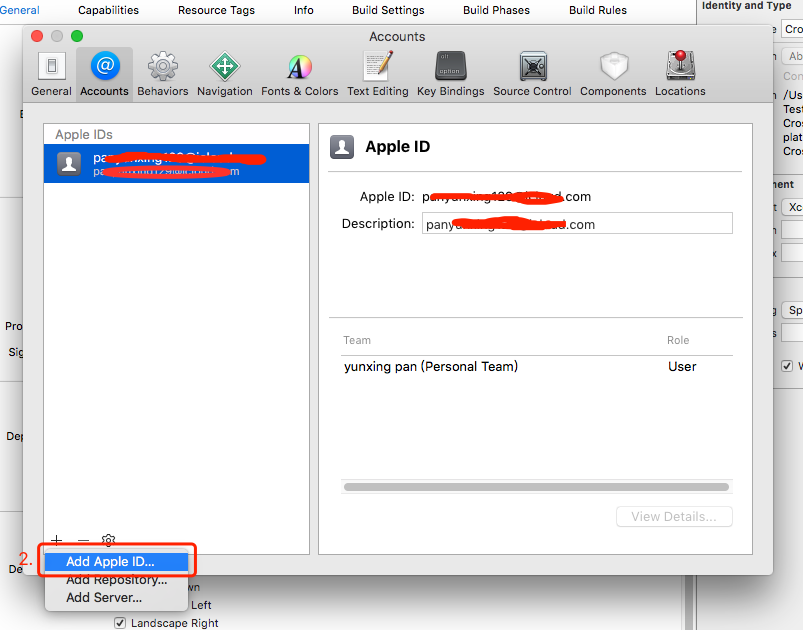

#Xcode 8.2.1无证书真机调试IOS 11.2

 
作者：潘全星   日期：2018-02-06

**首先确保你的iPhone通过USB连接上Mac系统的iTunes。**Xcode 8.2.1只支持真机到iOS 10.2。真机调试需要Apple ID，进入[苹果开发者中心](https://developer.apple.com/)，点击**Account**注册或登录，Apple ID一般是你的注册邮箱。

##让Xcode 8.x支持IOS 11.2设备真机调试
* 获取真机支持包：
	- 1.从[百度云盘下载](https://pan.baidu.com/s/1eS20QS6)，密码：5v35。
	- 2.从新版Xcode 9.x的位置
	  `Xcode.app//Contents/Developer/Platforms/iPhoneOS.platform/DeviceSupport`中获取对应版本的支持包。该目录打开如下界面：

* 获取到相对应于iOS系统版本的文件夹（支持包）复制到Xcode 8.x的位置
  `Xcode.app//Contents/Developer/Platforms/iPhoneOS.platform/DeviceSupport`下，重启Xcode即可。

##在Xcode中添加你的Apple ID
1.打开需要真机调试的项目，进入Xcode菜单栏选择`Xcode->Preferences`，在**Accounts**选项卡中添加你的Apple ID，如果没有请去[苹果开发者中心](https://developer.apple.com/)注册一个。如图所示：

2.在Xcode中选择用于调试的开发者账号，选中你的**项目**点击并选择**General**页，到`Signing->Team`选择你的账号。如图所示：

3.一般来说，已经可以连接真机调试了。如果还不行，请手动添加**证书**。

##在Xcode中手动给真机添加证书
1.点击`Xcode->Preferences`重新进入**Accounts**面板，通过`View Detils...->Download All Profiles`下载证书，在**Provisioning Profiles**下找到对应你的项目**com.example.projectName**的证书，**单击右键**选择**Show in Finder**。将相应的`.mobileprovision`证书文件拷贝到**新的位置**。如图所示：

2. 回到Xcode，点击`Windows->Devices`进入Devices面板，在**Installed Apps**下点击‘＋’按钮，找到并选择刚刚保存到**新的位置**的证书即可。如图所示：

##选择真机运行调试
1.在Xcode中选择你的真机，如图所示：

2.点击里面三角形的按钮运行调试。

##在真机中添加对开发者信任
1.应用装载到真机上，会报**不受信任的开发者**错误，如图所示：

2.在iphone`设置->通用->设备管理`下，点击**信任开发者**。如图所示：

